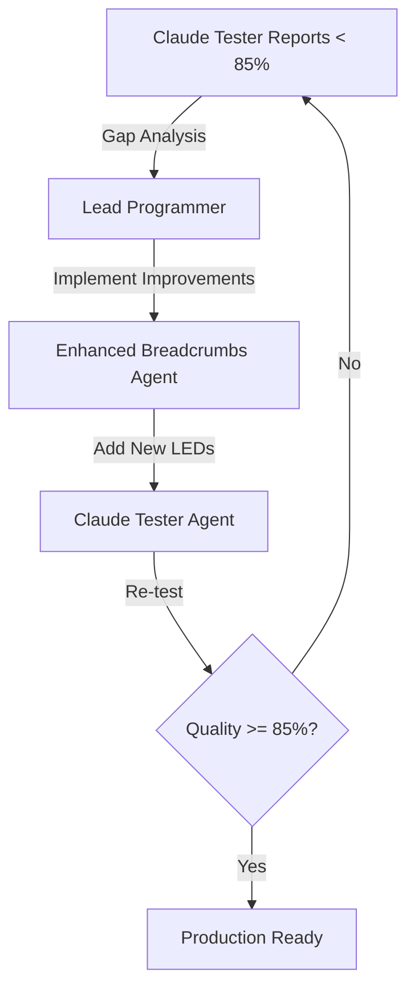

# Agent Deployment Sequence for New Code Development

## Overview
This document defines the standard agent deployment sequence that Claude follows when implementing new features or fixing issues in the VoiceCoach project.

---

## 🎯 Standard Deployment Sequence

### **Phase 1: Implementation (Lead Programmer)**
```
Task Tool → subagent_type: "Lead Programmer"
```
- Implements core functionality
- Adds error handling and edge cases
- Integrates with existing components
- Creates initial working version

### **Phase 2: Debugging Infrastructure (Breadcrumbs Agent)**
```
Task Tool → subagent_type: "Enhanced Breadcrumbs Agent"
```
- Adds LED tracking to new code
- Implements debug console commands
- Creates performance monitoring
- Ensures traceability of all operations

### **Phase 3: Testing & Validation (Claude Tester)**
```
Task Tool → subagent_type: "Claude Tester Agent"
```
- Runs comprehensive functional tests
- Validates quality against benchmarks
- Performs autonomous correction attempts
- Reports production readiness

---

## 📋 Deployment Instructions

### When Creating New Features

1. **Initial Task Creation**
```markdown
Use Task tool with:
- subagent_type: "Lead Programmer"
- prompt: "Implement [feature description] with proper error handling and integration"
```

2. **Add Debugging**
```markdown
Use Task tool with:
- subagent_type: "Enhanced Breadcrumbs Agent"  
- prompt: "Add LED debugging infrastructure to [feature] implementation"
```

3. **Test and Validate**
```markdown
Use Task tool with:
- subagent_type: "Claude Tester Agent"
- prompt: "Test [feature] using orchestrator approach with quality validation"
```

### When Fixing Bugs

1. **Diagnose First (Optional)**
```markdown
Use Task tool with:
- subagent_type: "VoiceCoach Diagnostic Agent"
- prompt: "Diagnose root cause of [issue description]"
```

2. **Implement Fix**
```markdown
Use Task tool with:
- subagent_type: "Lead Programmer"
- prompt: "Fix [issue] based on diagnostic findings"
```

3. **Add Debug Tracking**
```markdown
Use Task tool with:
- subagent_type: "Enhanced Breadcrumbs Agent"
- prompt: "Add LED tracking to monitor [fix] effectiveness"
```

4. **Validate Fix**
```markdown
Use Task tool with:
- subagent_type: "Claude Tester Agent"
- prompt: "Validate [fix] resolves issue without regressions"
```

---

## 🔄 Iterative Improvement Loop

When quality targets aren't met, follow this loop:



### Loop Instructions
1. **Claude Tester** generates specific gap report
2. **Lead Programmer** implements targeted improvements
3. **Breadcrumbs Agent** adds debugging for new code
4. **Claude Tester** re-validates quality
5. Repeat until quality >= 85%

---

## 🚨 Critical Agent Names

**IMPORTANT**: Use exact agent names as shown below (from the name field in .md files):

| File Name | Agent Name (use this in subagent_type) |
|-----------|----------------------------------------|
| lead_programmer.md | Lead Programmer |
| enhanced-breadcrumbs-agent.md | Enhanced Breadcrumbs Agent |
| claude-tester-agent.md | Claude Tester Agent |
| voicecoach-diagnostic-agent.md | VoiceCoach Diagnostic Agent |
| voicecoach-correction-agent.md | VoiceCoach Correction Agent |
| error-detection-agent.md | Error Detection Agent |
| error-correction-agent.md | Error Correction Agent |

**Common Mistake**: Do NOT use filename (e.g., "claude-tester-agent"), use the agent's name field (e.g., "Claude Tester Agent")

---

## 📊 Dashboard Updates

Each agent automatically updates the dashboard during execution:

### Lead Programmer Updates
- "Implementing [feature]..."
- "Implementation complete - [X] tasks done"
- Progress: +20-30% per major feature

### Breadcrumbs Agent Updates  
- "Adding LED tracking..."
- "LED tracking added to [X] files"
- Progress: +5% for instrumentation

### Claude Tester Agent Updates
- "Starting automated testing"
- "Running tests - [X/Y] passed"
- "Quality score: [X]%"
- "✅ PRODUCTION READY" or "❌ GAPS FOUND"
- Progress: +5-10% per test cycle

---

## 🎯 Quality Gates

### Before Moving to Next Phase

**Phase 1 → Phase 2**: 
- Core functionality must work
- No critical errors
- Basic integration complete

**Phase 2 → Phase 3**:
- LED tracking operational
- Debug commands working
- Error breadcrumbs in place

**Phase 3 → Production**:
- All tests passing
- Quality score >= 85%
- No regressions detected
- LED chain validates

---

## 💡 Best Practices

1. **Always Deploy in Order**: Lead Programmer → Breadcrumbs → Claude Tester
2. **Never Skip Breadcrumbs**: Debugging infrastructure is critical
3. **Trust Claude Tester**: If it says not ready, iterate
4. **Document Gaps**: Claude Tester should provide specific improvements needed
5. **Monitor LEDs**: Use debug console during testing to track flow

---

## 🔧 Special Cases

### Urgent Hotfixes
Can skip Breadcrumbs phase temporarily:
1. Lead Programmer (fix)
2. Claude Tester (validate)
3. Breadcrumbs Agent (add post-fix)

### Research Tasks
Different sequence for exploration:
1. Researcher Agent (investigate)
2. Lead Programmer (implement findings)
3. Standard sequence continues...

### UI-Only Changes
Modified sequence:
1. UI Designer (design)
2. Lead Programmer (implement)
3. Claude Tester (validate UX)

---

## 📝 Example Deployment

```markdown
User: "Add real Claude analysis to replace fake regex patterns"

Claude's Response:
"I'll deploy the implementation sequence for this feature:

1. First, I'll use the Lead Programmer agent to implement the core functionality
2. Then Enhanced Breadcrumbs Agent will add debugging infrastructure  
3. Finally, Claude Tester Agent will validate quality and functionality

Starting with Phase 1..."

[Uses Task tool with subagent_type: "Lead Programmer"]
[Waits for completion]
[Uses Task tool with subagent_type: "Enhanced Breadcrumbs Agent"]
[Waits for completion]
[Uses Task tool with subagent_type: "Claude Tester Agent"]
[Reviews results and iterates if needed]
```

---

## 🚀 Production Deployment Criteria

The feature/fix is ready for production when:
- ✅ Lead Programmer: Implementation complete
- ✅ Breadcrumbs Agent: Full LED coverage
- ✅ Claude Tester: Quality >= 85%
- ✅ Claude Tester: All functional tests pass
- ✅ Claude Tester: No regressions detected
- ✅ Complete LED chain validates (all expected LEDs fire)

---

**Remember**: This sequence ensures quality, debuggability, and reliability in all VoiceCoach development work.