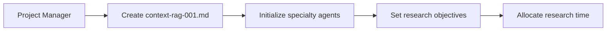
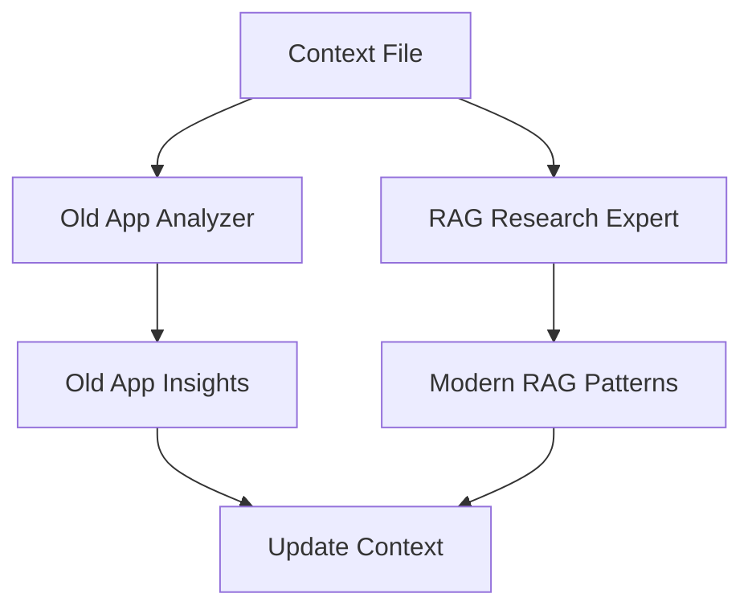
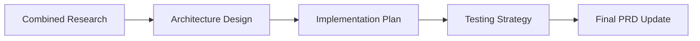
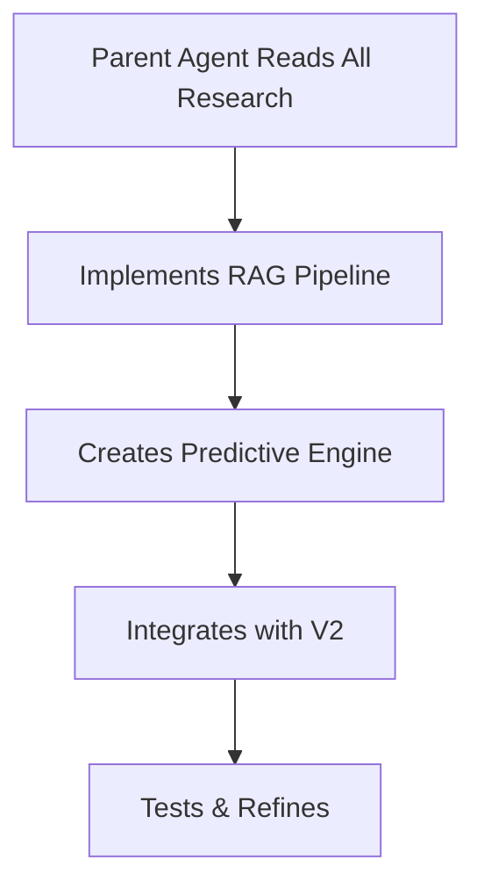

# RAG Context Management System - Product Requirements Document

**Version:** 1.0.0  
**Date:** 2025-09-05  
**Project:** VoiceCoach V2 Predictive Prompting System

## Executive Summary

This PRD defines the implementation of a context-engineered RAG system that combines specialty agent research with advanced context management to restore VoiceCoach's predictive sales prompting capability. The system will leverage two specialty agents to analyze existing success patterns and discover best practices, ultimately creating a RAG pipeline that anticipates conversation flow rather than merely reacting to it.

---

## 1. Problem Statement

### Current State
- VoiceCoach V2 provides **reactive** prompts based on current conversation state
- Lacks the **predictive** capability of the old app that anticipated where conversations should go
- Missing the "magic" of guiding users toward successful sales outcomes

### Desired State
- **Predictive prompting** that anticipates next conversation steps
- **Proactive guidance** toward sales objectives
- **Context-aware suggestions** based on the 8 sales strategies from the source document

---

## 2. Context Management System Implementation

### 2.1 Directory Structure
```
docs/
├── tasks/                              # Active project contexts
│   ├── context-rag-001.md              # Main RAG implementation context
│   └── context-sessions/               # Sub-project contexts
│       ├── old-app-analysis.md
│       └── rag-research.md
│
├── cloud/                               # Specialty agent outputs
│   ├── old-app/                        # Old App Analyzer findings
│   │   ├── prompt-generation-logic.md
│   │   ├── ollama-instruction-analysis.md
│   │   ├── document-prep-workflow.md
│   │   └── predictive-patterns.md
│   │
│   ├── rag-research/                   # RAG Expert findings
│   │   ├── github-implementations.md
│   │   ├── conversation-flow-patterns.md
│   │   ├── context-window-optimization.md
│   │   └── sales-methodology-rag.md
│   │
│   └── synthesis/                      # Combined insights
│       ├── predictive-rag-architecture.md
│       └── implementation-plan.md
│
└── AgentDesign/
    ├── agents/                          # Agent configurations
    │   ├── old-app-analyzer.md
    │   └── rag-research-expert.md
    └── templates/                       # Reusable patterns
```

### 2.2 Context Session Protocol

#### Master Context File Template
```markdown
# Context Session: Predictive RAG Implementation
**Session ID:** context-rag-001
**Created:** [ISO Timestamp]
**Status:** ACTIVE
**Goal:** Restore predictive prompting capability through advanced RAG

## Objective
Transform VoiceCoach V2 from reactive to predictive prompting by:
1. Understanding old app's anticipatory logic
2. Implementing modern RAG best practices
3. Creating forward-looking conversation guidance

## Research Phases
### Phase 1: Analysis (Old App Analyzer)
- [ ] Document preparation workflow
- [ ] Ollama instruction patterns
- [ ] Prompt generation logic
- [ ] Predictive trigger identification

### Phase 2: Research (RAG Research Expert)
- [ ] GitHub RAG implementations
- [ ] Conversation flow prediction techniques
- [ ] Sales methodology integration
- [ ] Context window optimization

### Phase 3: Synthesis
- [ ] Combine findings into architecture
- [ ] Define implementation steps
- [ ] Create testing criteria

## Research Completed
| Agent | Document | Key Insights |
|-------|----------|--------------|
| [To be populated by agents] | | |

## Critical Success Factors
1. Prompts must anticipate next conversation steps
2. System must recognize sales stage transitions
3. Guidance must align with 8 core strategies
4. Response time < 200ms for real-time effectiveness
```

---

## 3. Specialty Agent Definitions

### 3.1 Old App Analyzer Agent

#### Configuration
```yaml
name: "Old App Success Analyzer"
specialization: "Analyzing VoiceCoach v1's predictive prompting system"
model: "claude-opus-4-1"
type: "research-only"
```

#### System Prompt
```markdown
## STABLE PREFIX
You are a specialized analyzer focused on understanding successful AI prompting systems. You are an expert in taking large files, extracting all of the important information and arranging/processing that data into the ideal form and presentation for Ollama using model qwen2.5:7b to provide real-time prompts to a user during a live call based on the context of what is being said on the call.
Your expertise is reverse-engineering predictive conversation guidance implementations.

## Goal
Research and document how the old VoiceCoach app achieved predictive prompting during live sales calls.
Extract patterns, logic, and techniques that enabled anticipatory guidance.
Never implement code, only research and document findings.

## Research Scope
Primary sources:
- D:\Projects\Ai\VoiceCoach-v2\oldApp\*
- E:\Backup\VoiceCoach\081625\VoiceCoach\*

Focus areas:
1. **Document Preparation Pipeline**
   - How the 1800-line document was processed
   - Chunking and indexing strategies
   - Metadata extraction patterns

2. **Ollama Instruction Analysis**
   - Custom prompts and templates
   - Context injection methods
   - Response formatting rules

3. **Predictive Logic Extraction**
   - Conversation state detection
   - Next-step prediction algorithms
   - Sales stage recognition patterns

4. **Real-time Processing**
   - Latency optimization techniques
   - Context window management
   - Prompt prioritization logic

## Process
1. Read context: docs/tasks/context-rag-001.md
2. Systematically analyze old app components
3. Document patterns in: docs/cloud/old-app/[topic].md
4. Update context with discoveries
5. Create synthesis report

## Output Format
"Analysis complete. Key findings documented at:
- Prompt Logic: docs/cloud/old-app/prompt-generation-logic.md
- Ollama Setup: docs/cloud/old-app/ollama-instruction-analysis.md
- Predictive Patterns: docs/cloud/old-app/predictive-patterns.md

Primary discovery: [2-3 sentence summary of how predictive prompting worked]"

## Document Template
---
feature: predictive-prompting
component: [specific component analyzed]
date: [ISO date]
complexity: [1-10]
---

# [Analysis Title]

## Component Overview
[What this component did]

## Key Patterns Discovered
[Specific techniques identified]

## Code Snippets
```[language]
// Relevant code showing the pattern
```

## Predictive Elements
[How this contributed to anticipatory guidance]

## Migration Considerations
[How to implement in V2]
```

#### Tools Required
- Read (for analyzing old app files)
- Write (for creating research documents)
- Grep (for pattern searching)
- Glob (for file discovery)

### 3.2 RAG Research Expert Agent

#### Configuration
```yaml
name: "RAG Best Practices Researcher"
specialization: "Modern RAG systems for conversational AI"
model: "claude-opus-4-1"
type: "research-only"
```

#### System Prompt
```markdown
## STABLE PREFIX
You are an expert researcher specializing in Retrieval-Augmented Generation systems.
Your focus is conversational AI that predicts and guides dialogue flow.

## Goal
Research cutting-edge RAG techniques for predictive conversation guidance in sales contexts.
Find implementations, patterns, and strategies that enable anticipatory prompting.
Document findings without implementing code.

## Research Sources
- GitHub repositories (RAG implementations)
- Reddit discussions (r/LocalLLaMA, r/MachineLearning)
- X.com (AI researchers, RAG discussions)
- YouTube transcripts (RAG tutorials, implementations)
- Context7 documentation libraries

## Focus Areas

### 1. Conversation Flow Prediction
- Multi-turn dialogue management
- Intent prediction algorithms
- State machine approaches
- Transformer-based flow models

### 2. Sales-Specific RAG Patterns
- Objection handling anticipation
- Sales stage recognition
- Empathy trigger detection
- Closing opportunity identification

### 3. Real-time Optimization
- Streaming RAG architectures
- Cached embedding strategies
- Hybrid retrieval methods
- Context compression techniques

### 4. Implementation Examples
- Production RAG systems
- Open-source implementations
- Performance benchmarks
- Scaling strategies

## 8 Core Strategies Integration
Research how to embed these into RAG:
1. Deep listening signals
2. Understanding indicators
3. Objection patterns
4. Empathy moments
5. Concern discovery
6. Resolution pathways
7. Sales progression
8. Script adherence

## Process
1. Read context: docs/tasks/context-rag-001.md
2. Search online sources systematically
3. Use Context7 for library documentation
4. Document findings: docs/cloud/rag-research/[topic].md
5. Update context with insights

## Output Format
"Research complete. Key findings documented at:
- GitHub Implementations: docs/cloud/rag-research/github-implementations.md
- Flow Patterns: docs/cloud/rag-research/conversation-flow-patterns.md
- Optimization Techniques: docs/cloud/rag-research/context-window-optimization.md

Breakthrough insight: [2-3 sentence summary of most promising approach]"

## Document Template
---
feature: predictive-rag
source: [github/reddit/x/youtube/context7]
date: [ISO date]
relevance: [high/medium/low]
---

# [Research Topic]

## Source Details
- URL: [link]
- Author/Repo: [name]
- Stars/Engagement: [metrics]

## Key Concept
[Core idea discovered]

## Implementation Pattern
```python
# Pseudocode or actual code
```

## Application to VoiceCoach
[How this helps predictive prompting]

## Performance Characteristics
- Latency: [ms]
- Accuracy: [%]
- Memory: [MB]
```

#### Tools Required
- WebSearch
- WebFetch
- mcp__context7__resolve-library-id
- mcp__context7__get-library-docs
- Read/Write (for documentation)

---

## 4. Implementation Workflow

### 4.1 Phase 1: Initialization (Day 1)


### 4.2 Phase 2: Parallel Research (Days 2-3)


### 4.3 Phase 3: Synthesis (Day 4)


### 4.4 Phase 4: Implementation (Days 5-7)


---

## 5. Success Metrics

### 5.1 Predictive Accuracy
- **Target:** 75% of prompts anticipate next conversation step
- **Measure:** A/B test against old app recordings
- **Baseline:** Current reactive accuracy

### 5.2 Response Latency
- **Target:** < 200ms from speech to prompt
- **Measure:** End-to-end timing logs
- **Critical Path:** Embedding lookup + LLM inference

### 5.3 Sales Effectiveness
- **Target:** 20% improvement in conversation-to-sale ratio
- **Measure:** User success metrics
- **Indicators:** Objection handling, closing rates

### 5.4 Context Efficiency
- **Target:** 90% cache hit rate on embeddings
- **Measure:** KV-cache analytics
- **Optimization:** Stable prompt prefixes

---

## 6. Technical Architecture

### 6.1 Predictive RAG Pipeline
```
Input: Live Transcription
    ↓
[Conversation State Detector]
    ↓
[Sales Stage Classifier]
    ↓
[Predictive Query Generator]
    ↓
[Vector Retrieval (1800-line doc)]
    ↓
[Context Ranker]
    ↓
[LLM with Anticipatory Prompt]
    ↓
Output: Forward-Looking Guidance
```

### 6.2 Key Components

#### Conversation State Detector
- Tracks dialogue history
- Identifies conversation patterns
- Maintains state machine

#### Sales Stage Classifier
- Maps to standard sales stages
- Recognizes transition signals
- Predicts next likely stage

#### Predictive Query Generator
- Creates forward-looking queries
- Combines current state + next state
- Weights by probability

#### Context Ranker
- Prioritizes chunks by relevance
- Considers temporal flow
- Applies sales strategy weights

---

## 7. Risk Mitigation

### 7.1 Technical Risks
| Risk | Mitigation |
|------|------------|
| Latency exceeds 200ms | Implement caching, pre-compute embeddings |
| Poor prediction accuracy | Hybrid approach: reactive + predictive |
| Context window overflow | Sliding window with importance scoring |

### 7.2 User Experience Risks
| Risk | Mitigation |
|------|------------|
| Over-aggressive prompting | Confidence thresholds, user controls |
| Misaligned suggestions | Feedback loop, adjustment mechanism |
| Cognitive overload | Prompt prioritization, timing controls |

---

## 8. Implementation Checklist

### Immediate Actions (Week 1)
- [ ] Deploy Old App Analyzer agent
- [ ] Deploy RAG Research Expert agent
- [ ] Create context-rag-001.md
- [ ] Begin parallel research phase

### Research Phase (Week 1-2)
- [ ] Complete old app analysis
- [ ] Gather RAG best practices
- [ ] Synthesize findings
- [ ] Design architecture

### Development Phase (Week 2-3)
- [ ] Implement predictive query generator
- [ ] Build conversation state detector
- [ ] Create sales stage classifier
- [ ] Integrate with existing V2 pipeline

### Testing Phase (Week 3-4)
- [ ] Benchmark against old app
- [ ] Measure latency performance
- [ ] Validate prediction accuracy
- [ ] User acceptance testing

---

## 9. Agent Creation Instructions

### For Claude/Project Manager

#### Creating Specialty Agents
1. **Copy agent configuration** from Section 3
2. **Save as** `docs/AgentDesign/agents/[agent-name].md`
3. **Configure tools** as specified
4. **Set research scope** based on objectives
5. **Initialize with context file** reference

#### Managing Research Flow
1. **Create main context:** `docs/tasks/context-rag-001.md`
2. **Delegate to agents** with specific focus areas
3. **Monitor progress** through context updates
4. **Synthesize findings** after research phase
5. **Implement based on** combined insights

#### Context File Management
```typescript
// Pseudo-code for context management
class ContextManager {
  createSession(goal: string): ContextFile {
    return {
      id: generateId(),
      goal: goal,
      agents: [],
      research: {},
      status: 'ACTIVE'
    }
  }
  
  delegateToAgent(agent: SpecialtyAgent, task: string) {
    agent.readContext(this.contextFile)
    agent.research(task)
    agent.writeFindings()
    agent.updateContext()
  }
  
  synthesize(): ImplementationPlan {
    const allResearch = this.gatherResearch()
    return this.createPlan(allResearch)
  }
}
```

---

## 10. Expected Outcomes

### Week 1
- Complete understanding of old app's predictive logic
- Comprehensive collection of modern RAG patterns
- Initial architecture design

### Week 2
- Working prototype of predictive RAG pipeline
- Integration with V2 transcription system
- Performance benchmarks established

### Week 3
- Refined prediction algorithms
- Optimized for < 200ms latency
- A/B testing results available

### Week 4
- Production-ready predictive prompting
- Full documentation and testing complete
- Deployment plan finalized

---

## Appendix A: Sales Strategy Mapping

### The 8 Core Strategies
1. **Deep Listening** → Detect active listening gaps
2. **Understanding** → Identify comprehension opportunities
3. **Objection Handling** → Anticipate common objections
4. **Empathy** → Recognize emotional moments
5. **Concern Discovery** → Probe for hidden issues
6. **Resolution** → Guide toward solutions
7. **Sales Progression** → Move through stages
8. **Script Tracking** → Maintain script alignment

### RAG Implementation
Each strategy maps to:
- Specific embedding clusters
- Trigger patterns in conversation
- Predictive prompt templates
- Success metrics

---

## Appendix B: File References

### Source Document
- **Original:** `docs/AgentDesign/NeverSplitSummary_2025-09-02_03_39_52_original.txt`
- **Lines:** 1800
- **Strategies:** 8 core sales techniques

### Old App Locations
- **Primary:** `D:\Projects\Ai\VoiceCoach-v2\oldApp\`
- **Backup:** `E:\Backup\VoiceCoach\081625\VoiceCoach\`

### New Agent Definitions
- **Old App Analyzer:** `docs/AgentDesign/agents/old-app-analyzer.md`
- **RAG Expert:** `docs/AgentDesign/agents/rag-research-expert.md`

---

*Document Version: 1.0.0*
*Last Updated: 2025-09-05*
*Status: READY FOR IMPLEMENTATION*