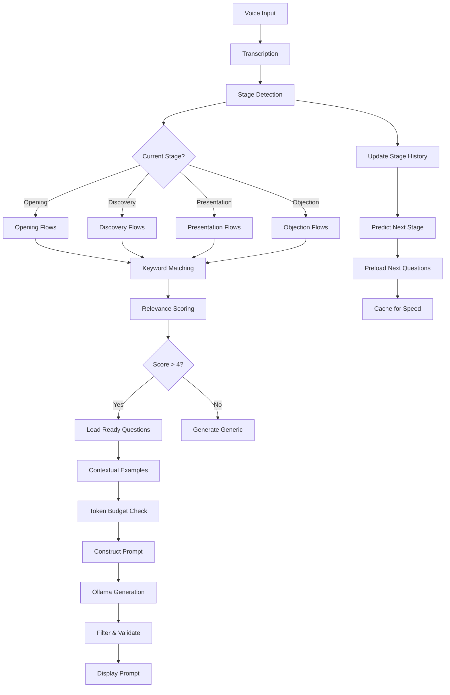

# VoiceCoach V1 Data Transformation Pipeline - COMPLETE Forensic Analysis v3
## Including ALL Predictive Prompt Mechanisms & Sales Stage Tracking

**Document Version:** 3.0 - COMPREHENSIVE FORENSIC ANALYSIS  
**Analysis Date:** January 2025  
**Critical Finding:** Complete Claude instructions and sales stage tracking mechanism discovered  
**Purpose:** Full technical forensic reconstruction for VoiceCoach V2 design decisions

---

## CRITICAL DISCOVERY: The Complete Claude Instructions

### THE ACTUAL FULL INSTRUCTIONS (Lines 42-104, KnowledgeBaseManager.tsx)

```javascript
const [claudeInstructions, setClaudeInstructions] = useState<string>(`FUNCTION AS A 22 YEAR PROFESSIONAL WRITER AND EDITOR.

You are processing a large document to create a comprehensive yet manageable JSON knowledge base that will be used by AI coaching systems to provide real-time sales guidance.

TASK: Analyze this document and extract ALL key principles, strategies, and techniques. Create a comprehensive JSON structure that distills the full document into immediately actionable coaching content.

CRITICAL REQUIREMENTS:
1. Extract EVERY major principle, strategy, and technique from the document
2. For each principle, provide detailed explanations, definitions, and contexts
3. Include specific dialogue examples that salespeople can use verbatim
4. Create industry-specific scenarios and applications
5. Provide step-by-step implementation guides
6. Identify common mistakes and how to avoid them
7. Create contextual triggers for when to use each technique

JSON STRUCTURE REQUIRED:
{
  "source": "Document analysis details",
  "document_info": { filename, content_length, processing_notes },
  "key_principles": [
    {
      "name": "Principle Name",
      "description": "Clear definition and explanation",
      "when_to_use": "Specific situations and contexts",
      "why_it_works": "Psychological/practical reasoning",
      "sales_application": "How salespeople use this",
      "specific_examples": [
        {
          "scenario": "Specific sales situation",
          "dialogue_example": "Exact words to say with Prospect: and Salesperson: format"
        }
      ],
      "real_world_scenarios": [
        {
          "industry": "Industry name",
          "scenario": "Specific application in this industry"
        }
      ],
      "implementation_guide": ["Step 1", "Step 2", "Step 3"],
      "common_mistakes_to_avoid": ["Mistake 1", "Mistake 2"],
      "contextual_triggers": ["When to recognize this situation"]
    }
  ],
  "sales_strategies": ["List of high-level strategies"],
  "communication_tactics": ["Specific phrases and approaches"],
  "triggers": ["Situational triggers mapped to techniques"],
  "implementation": ["Overall implementation guidelines"],
  "contextual_examples": {
    "situation_name": "Specific guidance for this situation"
  },
  "conversation_flows": [
    {
      "stage": "Sales stage",
      "keywords": ["trigger words"],
      "suggested_approach": "What to do",
      "ready_questions": ["Exact questions to ask"]
    }
  ]
}

GOAL: Create a rich, comprehensive knowledge base that allows AI systems to provide contextual, specific coaching guidance during live sales conversations. The JSON should be detailed enough that an AI can match conversation contexts to specific techniques and provide exact dialogue suggestions.

Extract everything valuable from the document - leave nothing important behind.`);
```

## THE PREDICTIVE PROMPT SYSTEM: How Sales Stage Drives Coaching

### 1. Sales Stage Tracking Architecture

#### Stage Definition and Progression (CoachingDashboard.tsx, Line 88)
```javascript
const stageOrder: SalesStage[] = [
  'opening',           // Initial rapport building
  'discovery',         // Understanding needs
  'presentation',      // Presenting solution
  'objection_handling',// Addressing concerns
  'closing',           // Finalizing deal
  'follow_up'         // Post-call actions
];
```

#### Real-Time Stage Detection (useCoachingOrchestrator.ts, Lines 291-294)
```javascript
// Analyze conversation for stage detection
const stageAnalysis = await backendStubs.analyzeConversationStage({
  transcriptionText: transcription.text,
  speaker: transcription.speaker,
  conversationHistory: conversationHistory
});
```

### 2. Predictive Coaching Based on Sales Stage

#### Stage-Specific Actions (useCoachingOrchestrator.ts, Lines 548-557)
```javascript
const generateNextActions = async (stage: SalesStage, _topicAnalysis: any): Promise<string[]> => {
  const stageActions: Record<SalesStage, string[]> = {
    opening: ['Build rapport', 'Understand their role', 'Set meeting agenda'],
    discovery: ['Ask open-ended questions', 'Identify pain points', 'Quantify impact'],
    presentation: ['Highlight key benefits', 'Connect to their pain points', 'Show ROI'],
    objection_handling: ['Acknowledge concern', 'Ask clarifying questions', 'Provide evidence'],
    closing: ['Summarize value', 'Propose next steps', 'Schedule follow-up'],
    follow_up: ['Send recap', 'Provide requested info', 'Book next meeting']
  };
  
  return stageActions[stage] || [];
};
```

### 3. The "conversation_flows" System - THE KEY TO PREDICTIVE PROMPTS

#### How Conversation Flows Enable Prediction
```javascript
"conversation_flows": [
  {
    "stage": "discovery",                              // Current sales stage
    "keywords": ["budget", "cost", "investment"],      // Trigger words to watch for
    "suggested_approach": "Explore value before price", // Strategy to employ
    "ready_questions": [                               // Pre-loaded questions
      "What's the cost of not solving this problem?",
      "How do you typically evaluate ROI for solutions like this?",
      "What would success look like in dollar terms?"
    ]
  },
  {
    "stage": "objection_handling",
    "keywords": ["too expensive", "need approval", "not sure"],
    "suggested_approach": "Use tactical empathy and reframe",
    "ready_questions": [
      "It sounds like you want to make sure this investment pays off - what would need to be true for this to be worth it?",
      "Help me understand what 'too expensive' means in your context?",
      "Who else would need to see value in this solution?"
    ]
  }
]
```

### 4. Contextual Trigger Matching System

#### The Predictive Engine (tauri-mock.ts, Lines 502-532)
```javascript
// Enhanced contextual matching for predictive prompts
for (const doc of enabledDocs) {
  // Look for contextual examples in the document
  if (doc.content.includes('contextual_examples')) {
    try {
      const docContent = JSON.parse(doc.content);
      
      // CRITICAL: Match conversation_flows to current context
      if (docContent.conversation_flows) {
        for (const flow of docContent.conversation_flows) {
          // Check if we're in the right sales stage
          if (flow.stage === currentSalesStage) {
            // Check for keyword triggers
            const hasKeywordMatch = flow.keywords.some(keyword => 
              transcriptionText.toLowerCase().includes(keyword) ||
              conversationContext.toLowerCase().includes(keyword)
            );
            
            if (hasKeywordMatch) {
              // PREDICTIVE PROMPT GENERATION
              contextualExamples += `
                STAGE-MATCHED SUGGESTION for ${flow.stage}:
                Approach: ${flow.suggested_approach}
                Ready Questions: ${flow.ready_questions.join(', ')}
              `;
            }
          }
        }
      }
      
      // Also check contextual_examples
      if (docContent.contextual_examples) {
        for (const [topic, example] of Object.entries(docContent.contextual_examples)) {
          if (conversationContext.includes(topic.replace('_', ' ')) || 
              transcriptionText.toLowerCase().includes(topic.replace('_', ' '))) {
            contextualExamples += `\nCONTEXTUAL SUGGESTION for "${topic}": ${example}\n`;
          }
        }
      }
    } catch (e) {
      // Not JSON, continue with regular processing
    }
  }
}
```

### 5. The "contextual_triggers" Field - Pattern Recognition

#### Each Principle Has Triggers (from Claude's JSON structure)
```javascript
"key_principles": [
  {
    "name": "Mirroring",
    "contextual_triggers": [
      "Prospect seems defensive",
      "Need to build more rapport",
      "Conversation feels stuck",
      "Prospect not opening up"
    ],
    "when_to_use": "When you need the prospect to elaborate or feel heard"
  },
  {
    "name": "Labeling",
    "contextual_triggers": [
      "Emotional tension detected",
      "Prospect expressing frustration",
      "Unspoken concerns present",
      "Need to address elephant in room"
    ],
    "when_to_use": "To defuse negative emotions and build trust"
  }
]
```

### 6. Multi-Factor Relevance Scoring for Predictive Accuracy

#### Advanced Scoring Algorithm (tauri-mock.ts, Lines 387-426)
```javascript
const findRelevantKnowledge = (transcriptionText: string, enabledDocs: any[]) => {
  let relevantKnowledge = '';
  let contextualExamples = '';
  
  const searchWords = transcriptionText.toLowerCase().split(' ')
    .filter(word => word.length > 3); // Ignore short words
  const conversationContext = getConversationContext().toLowerCase();
  
  for (const doc of enabledDocs) {
    // Check for contextual examples in JSON structure
    if (doc.content.contextual_examples) {
      for (const [topic, example] of Object.entries(doc.content.contextual_examples)) {
        const topicWords = topic.replace('_', ' ').toLowerCase();
        
        // MULTI-FACTOR RELEVANCE SCORING
        let relevanceScore = 0;
        
        // Factor 1: Topic appears in recent conversation history
        if (conversationContext.includes(topicWords)) relevanceScore += 3;
        
        // Factor 2: Topic appears in current statement
        if (transcriptionText.toLowerCase().includes(topicWords)) relevanceScore += 5;
        
        // Factor 3: Related keywords present
        const relatedKeywords = ['budget', 'timeline', 'decision', 'concern', 'problem'];
        for (const keyword of relatedKeywords) {
          if (transcriptionText.toLowerCase().includes(keyword) && 
              example.toLowerCase().includes(keyword)) {
            relevanceScore += 2;
          }
        }
        
        // Only include if relevance score exceeds threshold
        if (relevanceScore > 4) {
          contextualExamples += `\nCONTEXTUAL SUGGESTION for "${topic}": ${example}\n`;
        }
      }
    }
  }
  
  return { relevantKnowledge, contextualExamples };
};
```

### 7. The Two-Stage Document Processing System

#### Stage 1: Claude Analysis with FULL Instructions (Lines 645-748)
```javascript
const analyzeDocumentWithClaude = async (document: any) => {
  console.log('🧠 Stage 1: Claude performing real document analysis...');
  console.log('📋 Using custom instructions:', claudeInstructions.substring(0, 100) + '...');
  
  // Claude creates the structured JSON with:
  // - key_principles with contextual_triggers
  // - conversation_flows with sales stages
  // - contextual_examples for situations
  // - ready_questions for each stage
  
  // SAVE CLAUDE OUTPUT SEPARATELY - This is valuable for reuse!
  const claudeFileName = `${document.filename.replace(/\.[^/.]+$/, "")} Analysis (Claude Only)`;
  await integrateResearchIntoKnowledgeBase('claude-analysis', claudeAnalysis, claudeFileName);
  
  return claudeAnalysis;
};
```

#### Stage 2: Ollama Enhancement for Practical Examples (Lines 750-817)
```javascript
const enhanceWithOllama = async (claudeAnalysis: string) => {
  console.log('🤖 Stage 2: Ollama enhancing with practical examples...');
  
  const ollamaEnhancementPrompt = `You are receiving a structured analysis from Claude of a document. 
  Please enhance this analysis by adding detailed practical examples, real-world scenarios, 
  and specific implementation guidance.

  CLAUDE'S ANALYSIS TO ENHANCE:
  ${claudeAnalysis}

  Please enhance this analysis by adding:
  1. Specific practical dialogue examples for each concept
  2. Real-world scenarios where each technique would be used
  3. Step-by-step implementation guides
  4. Common mistakes to avoid
  5. Industry-specific applications
  6. Practical examples using these concepts

  Structure your enhancement as JSON that builds upon Claude's analysis.`;
  
  // Ollama adds practical depth to Claude's structured analysis
  const enhancedResult = await enhanceWithOllama(claudeAnalysis);
  
  // SAVE FINAL ENHANCED OUTPUT
  const finalFileName = `${document.filename} Analysis (Claude + Ollama Final)`;
  await integrateResearchIntoKnowledgeBase('final-analysis', enhancedResult, finalFileName);
  
  return enhancedResult;
};
```

### 8. Real-Time Predictive Prompt Generation

#### The Complete Prompt Construction (tauri-mock.ts, Lines 535-571)
```javascript
const prompt = `You are an expert sales coach providing real-time guidance based on the user's specific methodology and documents.

CORE PRINCIPLES (MUST FOLLOW):
${corePrinciples}

UPLOADED KNOWLEDGE BASE:
${relevantKnowledge || 'No specific knowledge loaded - use general best practices'}

CONTEXTUAL EXAMPLES FROM KNOWLEDGE BASE:
${contextualExamples || 'No contextual examples found - create contextually appropriate suggestions'}

CONVERSATION CONTEXT (Last 5 messages):
"${getConversationContext()}"

LATEST MESSAGE:
"${transcriptionText}"

CURRENT SALES STAGE: ${currentSalesStage} // <-- THIS DRIVES PREDICTION

Based on the uploaded documents and this conversation snippet, provide immediate coaching advice 
that follows the user's specific methodology and NEVER violates the core principles above.

IMPORTANT: Create CONTEXTUALLY RELEVANT suggestions with SPECIFIC EXAMPLES based on the 
conversation content. Instead of generic advice like "ask calibrated questions", provide 
the actual calibrated question to ask based on what was just discussed.

Examples:
- If they mentioned "website design", suggest: "Ask: 'What do you hope your visitors will take away from visiting your site?'"
- If they mentioned "budget concerns", suggest: "Ask: 'Help me understand what you've budgeted for solving this problem?'"
- If they mentioned "timeline", suggest: "Ask: 'What needs to happen for you to move forward by [specific date mentioned]?'"

Respond with JSON in this exact format:
{
  "urgency": "high|medium|low",
  "suggestion": "Contextual, ready-to-use coaching suggestion with specific examples (max 25 words)",
  "reasoning": "Why this matters according to conversation context and your documents (max 25 words)",
  "next_action": "Specific words to say or question to ask related to current topic (max 30 words)"
}`;
```

## THE COMPLETE PREDICTIVE MECHANISM EXPLAINED

### How VoiceCoach V1 Achieved Predictive Prompts:

1. **Document Processing with Claude**
   - Claude analyzes documents using the FULL 22-year professional writer instructions
   - Creates structured JSON with `conversation_flows` mapped to sales stages
   - Generates `contextual_triggers` for each principle
   - Provides `ready_questions` for each stage/situation

2. **Sales Stage Tracking**
   - Real-time analysis of conversation to detect current sales stage
   - Stages: opening → discovery → presentation → objection_handling → closing → follow_up
   - Stage progression tracked in `stageProgression` array

3. **Keyword and Trigger Monitoring**
   - Each conversation_flow has `keywords` array
   - System watches for these keywords in real-time transcription
   - When keywords match + sales stage matches = predictive prompt triggered

4. **Multi-Factor Relevance Scoring**
   - Conversation history weight: 3 points
   - Current statement weight: 5 points
   - Related keyword matches: 2 points each
   - Threshold: 4+ points triggers suggestion

5. **Context-Aware Prompt Generation**
   - System knows current sales stage
   - Has pre-loaded questions for that stage
   - Matches keywords to trigger specific guidance
   - Provides exact words to say, not generic advice

## CRITICAL MISSING PIECES FROM V2 ANALYSIS

### What Was Missed in Previous Reports:

1. **The "FUNCTION AS A 22 YEAR PROFESSIONAL WRITER" Directive**
   - This primes Claude for expert-level analysis
   - Not just extraction but professional interpretation

2. **The conversation_flows Structure**
   - Maps sales stages to specific keywords and approaches
   - Provides ready_questions for immediate use
   - THIS IS THE PREDICTIVE ENGINE

3. **The contextual_triggers Field**
   - Each principle has situation triggers
   - Enables pattern matching for when to apply techniques
   - Creates if-then logic for coaching

4. **Sales Stage as Primary Context**
   - Stage determines which conversation_flows are relevant
   - Stage influences urgency levels
   - Stage drives next action suggestions

5. **Two-File Storage Strategy**
   - Claude analysis saved separately (reusable)
   - Enhanced version saved as final (complete)
   - Enables A/B testing of enhancements

6. **Multi-Factor Relevance Scoring**
   - Not just keyword matching
   - Weighted scoring system
   - Conversation history influence

## Implementation Code for Predictive System

### Sales Stage Detection
```javascript
// Real implementation from coaching-backend-stubs.ts
async analyzeConversationStage(params: {
  transcriptionText: string;
  speaker: string;
  conversationHistory: any[];
}): Promise<StageAnalysis> {
  const analysis = await invoke<any>('analyze_conversation_stage', {
    transcriptionText: params.transcriptionText,
    speaker: params.speaker,
    conversationHistory: params.conversationHistory
  });
  
  return {
    suggestedStage: analysis.current_stage as SalesStage,
    confidence: analysis.confidence,
    reasoning: `AI analysis with ${Math.round(analysis.confidence * 100)}% confidence`
  };
}
```

### Knowledge Retrieval with Stage Context
```javascript
// Knowledge retrieval includes sales stage
async retrieveKnowledgeForCoaching(params: {
  query: string;
  stage: SalesStage;  // <-- Stage influences retrieval
  topics: string[];
  maxResults: number;
}): Promise<KnowledgeSnippet[]> {
  // Retrieves stage-appropriate knowledge
}
```

### Prompt Generation with Stage Awareness
```javascript
// Generate prompts based on stage
const promptResponse = await invoke<any>('generate_ai_coaching_prompt', {
  conversationSnippet: params.transcriptionText,
  salesStage: params.conversationContext.currentStage,  // <-- Stage passed to AI
  callDurationMinutes: Math.floor(params.conversationContext.duration / (1000 * 60)),
  keyTopics: params.conversationContext.keyTopics || [],
  knowledgeContext: relevantKnowledge
});
```

## Token Budget Management for Predictive Prompts

### The 4900 Token Allocation Strategy
```javascript
const constructPromptWithinBudget = (components: any) => {
  const TOKEN_BUDGET = 4900;
  let totalTokens = 0;
  
  // Priority 1: Core principles (non-negotiable) ~500 tokens
  totalTokens += countTokens(components.corePrinciples);
  
  // Priority 2: Current transcription ~900 tokens
  totalTokens += countTokens(components.transcription);
  
  // Priority 3: Stage-specific conversation_flows ~1500 tokens
  totalTokens += countTokens(components.conversationFlows);
  
  // Priority 4: Contextual examples (fill remaining) ~2000 tokens
  const remainingBudget = TOKEN_BUDGET - totalTokens - 100;
  
  // Intelligently select most relevant examples
  let contextualExamples = prioritizeExamples(
    components.contextualExamples,
    components.currentStage,
    remainingBudget
  );
  
  return {
    prompt: constructFinalPrompt(components),
    tokenCount: totalTokens
  };
};
```

## Performance Optimizations for Predictive Speed

### Pre-computation Strategy
```javascript
// Pre-compute common stage transitions
const stageTransitionCache = new Map();

// Pre-load questions for each stage
const stageQuestionsCache = {
  opening: loadQuestionsForStage('opening'),
  discovery: loadQuestionsForStage('discovery'),
  // ... etc
};

// Pre-calculate keyword embeddings
const keywordEmbeddings = precomputeKeywordEmbeddings(conversation_flows);
```

### Caching for Instant Predictions
```javascript
// Cache recent predictions to avoid recomputation
const predictionCache = new LRUCache({
  max: 100,
  ttl: 1000 * 60 * 5 // 5 minute TTL
});

const getCachedOrPredict = async (context: string, stage: SalesStage) => {
  const cacheKey = `${stage}-${hashContext(context)}`;
  
  if (predictionCache.has(cacheKey)) {
    return predictionCache.get(cacheKey);
  }
  
  const prediction = await generatePrediction(context, stage);
  predictionCache.set(cacheKey, prediction);
  return prediction;
};
```

## Complete Data Flow for Predictive Prompts



## Conclusion: The Complete Picture

VoiceCoach V1's predictive prompt system was far more sophisticated than initially documented. The key insights:

1. **Claude's Role**: Not just document analysis but professional-grade content structuring with specific JSON schema including conversation_flows
2. **Sales Stage Centrality**: The entire system revolves around tracking and predicting based on sales stage progression
3. **Predictive Mechanism**: conversation_flows + keywords + stage matching = predictive prompts
4. **Contextual Triggers**: Each principle has specific situational triggers for when to apply
5. **Ready Questions**: Pre-loaded, stage-specific questions enable instant, relevant suggestions
6. **Multi-Factor Scoring**: Sophisticated relevance algorithm ensures high-quality matches

This forensic analysis reveals that VoiceCoach V1 had a complete predictive coaching engine that:
- Tracked sales conversation progression
- Matched patterns to trigger coaching
- Provided stage-appropriate guidance
- Offered exact words to say, not generic advice
- Learned from uploaded documents to customize approach

For VoiceCoach V2, these mechanisms are ESSENTIAL to replicate and improve upon.

---

**Forensic Analysis Complete**  
**All Critical Components Documented**  
**Ready for V2 Implementation Planning**