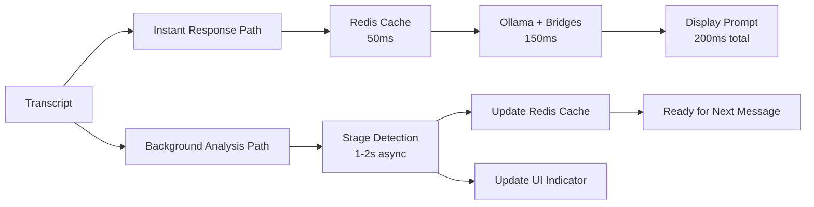

# Smart Stage Implementation: Async Detection with Instant Response

## Core Architecture Principle

**Stage detection is for PRE-POSITIONING, not blocking real-time response**

The stage tells us what bridges to pre-load into fast cache, but doesn't block Ollama from responding immediately to the actual transcript.

## Three-Layer Speed Architecture

### Layer 1: Instant Bridge Cache (<50ms)
```typescript
// Redis/KeyDB stores pre-loaded bridges for current stage
interface StageBridgeCache {
  currentStage: SalesStage;
  preloadedBridges: BridgeQuestion[];
  commonObjections: ObjectionResponse[];
  stageProgress: number;
  lastUpdate: timestamp;
}

// Pre-loaded in Redis based on current stage
const BRIDGE_CACHE_KEY = `stage:${currentStage}:bridges`;
const bridges = await redis.get(BRIDGE_CACHE_KEY);
// Returns instantly: ["What's the impact?", "How long has this been an issue?", ...]
```

### Layer 2: Real-Time Ollama Response (<200ms)
```typescript
// Ollama gets transcript + cached bridges, responds immediately
class RealTimeCoachingService {
  async generateInstantPrompt(transcript: string): Promise<CoachingPrompt> {
    // Get pre-loaded bridges for current stage (cached)
    const cachedBridges = await redis.get(`stage:${this.currentStage}:bridges`);
    
    // Simple, focused prompt for qwen2.5:7b
    const prompt = `
    Customer said: "${transcript}"
    
    Available responses for ${this.currentStage} stage:
    ${cachedBridges.map(b => `- ${b.question}`).join('\n')}
    
    Pick the best response or create a specific variation.
    Respond with: {"suggestion": "...", "urgency": "high|medium|low"}
    `;
    
    // Fast Ollama call with small model
    return await ollama.generate(prompt, { 
      model: 'qwen2.5:7b',
      max_tokens: 100,
      timeout: 200 // Hard 200ms timeout
    });
  }
}
```

### Layer 3: Background Stage Analysis (Async, 1-5s)
```typescript
// Runs async, doesn't block responses
class BackgroundStageAnalyzer {
  private worker: Worker;
  
  constructor() {
    // Run in separate thread/worker
    this.worker = new Worker('./stage-analyzer.worker.js');
    
    this.worker.on('stageChanged', async (newStage) => {
      // Pre-load next stage's bridges into Redis
      await this.preloadStageBridges(newStage);
      
      // Update UI indicator (non-blocking)
      this.emit('stageUpdate', newStage);
    });
  }
  
  analyzeTranscript(transcript: string) {
    // Send to background worker, don't wait
    this.worker.postMessage({ 
      type: 'analyze',
      transcript,
      history: this.conversationHistory 
    });
    
    // Returns immediately, analysis happens in background
  }
  
  private async preloadStageBridges(stage: SalesStage) {
    const nextStage = this.getNextStage(stage);
    const bridges = this.stageProgressions[`${stage}_to_${nextStage}`].bridges;
    
    // Cache bridges for instant access
    await redis.setex(
      `stage:${stage}:bridges`,
      300, // 5 minute TTL
      JSON.stringify(bridges)
    );
    
    // Also pre-load common objections for this stage
    const objections = this.getCommonObjections(stage);
    await redis.setex(
      `stage:${stage}:objections`,
      300,
      JSON.stringify(objections)
    );
  }
}
```

## Smart Stage Detection Using Vector Similarity

### Use ChromaDB/Vector DB for Background Intelligence
```typescript
// Background process that runs every few messages
class VectorStageAnalyzer {
  private chroma: ChromaClient;
  private stageEmbeddings: Map<SalesStage, number[]>;
  
  async analyzeStageAsync(conversationHistory: string[]): Promise<StageAnalysis> {
    // This can take 1-2 seconds, runs in background
    const contextEmbedding = await this.embed(conversationHistory.join(' '));
    
    // Find most similar stage pattern
    const similarities = await this.chroma.query({
      queryEmbeddings: [contextEmbedding],
      nResults: 3,
      where: { type: 'stage_pattern' }
    });
    
    // Determine stage with confidence
    const stage = this.determineStage(similarities);
    
    // Check for stage transition indicators
    const transitionSignals = this.detectTransitionSignals(conversationHistory);
    
    return {
      currentStage: stage,
      confidence: similarities[0].score,
      nextStageReady: transitionSignals.length > 2,
      suggestedBridges: this.getBridgesForStage(stage)
    };
  }
}
```

## Implementation Flow



## Key Improvements Over Original Plan

### 1. **Non-Blocking Architecture**
- Stage detection NEVER blocks coaching response
- Background worker handles heavy analysis
- UI updates asynchronously

### 2. **Intelligent Pre-Loading**
```typescript
// When stage changes, pre-load:
- Next stage's bridge questions
- Common objections for new stage
- Contextual examples
- Stage-specific prompts

// All cached in Redis for instant access
```

### 3. **Hybrid Detection Strategy**
```typescript
// Fast Path (every message):
- Keyword counting (5ms)
- Recent context check (10ms)
- Confidence scoring (5ms)
Total: 20ms

// Slow Path (every 3-5 messages):
- Vector similarity search (1s)
- Pattern matching (500ms)
- Full context analysis (500ms)
Total: 2s (background)
```

### 4. **Smart Caching Strategy**
```typescript
class StageCacheManager {
  // Cache hierarchy
  L1_CACHE = {
    // Ultra-fast memory cache (< 1ms)
    currentStage: 'discovery',
    cachedBridges: [...],
    lastTranscript: '...'
  };
  
  L2_CACHE = Redis {
    // Fast persistent cache (< 10ms)
    'stage:discovery:bridges': [...],
    'stage:discovery:objections': [...],
    'stage:discovery:examples': [...]
  };
  
  L3_CACHE = ChromaDB {
    // Slow semantic search (1-2s)
    // Used only for background analysis
    stagePatterns: [...],
    historicalTransitions: [...],
    successfulConversations: [...]
  };
}
```

## Optimal Tech Stack

### For Real-Time Response
- **Redis/KeyDB**: Pre-loaded bridges and objections
- **Ollama qwen2.5:7b**: Fast, focused generation
- **Memory Cache**: Current stage and context

### For Background Analysis
- **ChromaDB**: Pattern matching and stage detection
- **Web Worker**: Non-blocking JavaScript thread
- **Event System**: Async updates to UI

## Implementation Code Structure

```typescript
// src/services/coaching/real-time-coaching.service.ts
export class RealTimeCoachingService {
  constructor(
    private redis: RedisClient,
    private ollama: OllamaService,
    private stageAnalyzer: BackgroundStageAnalyzer
  ) {}
  
  async handleTranscript(transcript: string): Promise<CoachingPrompt> {
    // 1. Get instant response (blocking path)
    const promptPromise = this.generateInstantPrompt(transcript);
    
    // 2. Trigger background analysis (non-blocking)
    this.stageAnalyzer.analyzeTranscript(transcript);
    
    // 3. Return prompt immediately
    const prompt = await promptPromise;
    
    // 4. Log performance
    console.log(`Response time: ${performance.now()}ms`);
    
    return prompt;
  }
  
  private async generateInstantPrompt(transcript: string): Promise<CoachingPrompt> {
    // Get cached bridges for current stage
    const bridges = await this.redis.get(`stage:${this.currentStage}:bridges`);
    
    if (!bridges || bridges.length === 0) {
      throw new Error(`NO BRIDGES CACHED FOR STAGE: ${this.currentStage}`);
    }
    
    // Quick Ollama call with pre-loaded context
    const response = await this.ollama.generateQuick({
      transcript,
      bridges,
      maxTime: 150 // 150ms max
    });
    
    return response;
  }
}
```

## Performance Targets

```
Operation                  | Target  | Method
--------------------------|---------|------------------
Get cached bridges        | <10ms   | Redis
Generate Ollama response  | <150ms  | qwen2.5:7b
Total response time       | <200ms  | Parallel processing
Stage detection           | 1-2s    | Background async
Cache update              | <50ms   | Redis SETEX
UI indicator update       | <10ms   | Event emission
```

## Benefits of This Approach

1. **Never Blocks**: Real-time response always <200ms
2. **Always Ready**: Pre-loaded bridges for instant access
3. **Continuously Learning**: Background analysis improves over time
4. **Graceful Degradation**: If stage detection fails, still have cached bridges
5. **Scalable**: Can add more intelligence without slowing responses

## Implementation Priority

### Week 1: Core Speed Infrastructure
1. Set up Redis with bridge caching
2. Implement instant Ollama response path
3. Basic keyword-based stage detection

### Week 2: Background Intelligence
1. Web Worker for async stage analysis
2. ChromaDB for pattern matching (background only)
3. Event system for UI updates

### Week 3: Optimization
1. Pre-loading strategies
2. Cache warming on startup
3. Performance monitoring

## Key Difference from Original Plan

**Original**: Stage detection → Then generate prompt (sequential)
**Improved**: Generate prompt with cached context → Update stage async (parallel)

This ensures we NEVER wait for stage detection to provide coaching!