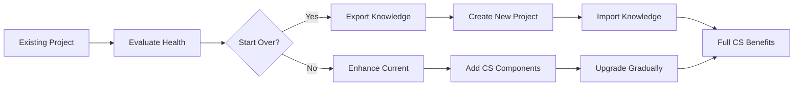

# Context System PRD - LED-Enhanced Persistent Intelligence
**Version 5.0 | Date: 2025-09-04**  
**Author: System Architecture Team**  
**Status: Production-Ready with Portability Architecture**

## Executive Summary

The Context System solves Claude's fundamental limitation: catastrophic context loss during `/compact` operations and between sessions. Version 5.0 introduces **Context System Portability Architecture** - making the entire system reusable across projects with one-command installation and clear separation between portable core components (cs-*) and project-specific elements (ps-*).

Key innovation: The Context System is now a portable development accelerator that grows smarter with each project, carrying deep specialist knowledge and proven patterns to every new codebase.

## Problem Statement

### Current Pain Points

1. **Context Amnesia**
   - New Claude sessions start with zero project knowledge
   - `/compact` operations destroy 90% of conversation context
   - Same mistakes repeated across sessions

2. **Manual Debugging Burden**
   - Developer spends hours debugging issues Claude created
   - No automatic validation of implementations

3. **Knowledge Fragmentation** (NEW)
   - Specialists rebuilt for each project
   - Proven patterns not reused
   - No standardization across codebases
   - Starting from scratch repeatedly

4. **Project Migration Difficulty** (NEW)
   - Hard to evaluate "start over vs improve"
   - Knowledge lost when switching projects
   - No systematic preservation of decisions

5. **Token Exhaustion**
   - Finding code requires extensive searching
   - No knowledge persistence between sessions

6. **Hidden Failures**
   - Fallback/simulated data masks real problems

### Impact Analysis

- **Cross-Project Waste**: 70% of specialist knowledge recreated per project
- **Setup Time**: 2-3 days to establish context system per project
- **Knowledge Loss**: Valuable patterns abandoned with old projects
- **Standardization**: No consistent approach across team projects

## Solution Overview

### Core Innovation

**Portable Context System**: One-command installation brings battle-tested specialists, protocols, and patterns to any project.

**Naming Convention**: `cs-*` prefix for portable components, `ps-*` for project-specific.

### Key Principles

1. **Write Once, Use Everywhere**: Specialists portable across projects
2. **Progressive Enhancement**: Start with core, add project-specific
3. **Knowledge Preservation**: Decisions and patterns carry forward
4. **Instant Setup**: New project to full context system in minutes
5. **Community Sharing**: Exchange specialists with other developers

## Context System Portability Architecture

### Core Package Structure

```
CONTEXT-SYSTEM-CORE/ (Portable Package)
├── 📦 cs-agents/                    # Context System Agents
│   ├── cs-vosk-specialist/
│   │   ├── agent.json              # Agent configuration
│   │   ├── knowledge-base.md       # Deep expertise
│   │   ├── test-scenarios.json     # Validation suite
│   │   └── version.yaml            # Version tracking
│   ├── cs-websocket-specialist/
│   ├── cs-chromadb-specialist/
│   ├── cs-playwright-tester/
│   ├── cs-react-specialist/
│   ├── cs-electron-specialist/
│   ├── cs-brainstorm-agent/
│   ├── cs-inversion-agent/
│   └── cs-error-visibility/
│
├── 📦 cs-protocols/                 # Core Procedures
│   ├── cs-agent-creation.md
│   ├── cs-fail-loud.md
│   ├── cs-inversion-thinking.md
│   ├── cs-workflow-phases.md
│   └── cs-testing-pipeline.md
│
├── 📦 cs-templates/                 # Reusable Templates
│   ├── agent-instruction.template
│   ├── knowledge-base.template
│   ├── validation-suite.template
│   └── project-structure.template
│
├── 📦 cs-core/                      # Core Implementation
│   ├── breadcrumbs-enhanced.ts
│   ├── context-manager.ts
│   ├── agent-router.ts
│   ├── kv-cache-optimizer.ts
│   └── test-automation.ts
│
├── 📦 cs-led-ranges/                # Reserved Ranges
│   ├── standard-ranges.yaml
│   └── range-validator.ts
│
├── 📦 cs-tools/                     # Utility Scripts
│   ├── cs-install.js               # Installation script
│   ├── cs-migrate.js               # Migration tool
│   ├── cs-export.js                # Export utility
│   └── cs-evaluate.js              # Project evaluator
│
└── 📦 INSTALL.md                    # Setup documentation
```

### Universal Naming Convention

```typescript
const NAMING_CONVENTION = {
  // Core Context System (Always Portable)
  "cs-": {
    meaning: "Context System Core",
    portable: true,
    examples: [
      "cs-vosk-specialist",      // Domain specialist
      "cs-fail-loud",            // Core protocol
      "cs-led-index",            // System file
      "cs-breadcrumbs"           // Core feature
    ]
  },
  
  // Project Specific (Never Portable)
  "ps-": {
    meaning: "Project Specific",
    portable: false,
    examples: [
      "ps-voicecoach-ui",        // Project UI
      "ps-sales-analyzer",       // Business logic
      "ps-custom-rag",           // Proprietary feature
      "ps-client-integration"    // Client-specific
    ]
  },
  
  // Hybrid (Portable with Configuration)
  "hs-": {
    meaning: "Hybrid System",
    portable: "with-config",
    examples: [
      "hs-database-connector",   // Needs DB config
      "hs-api-client",          // Needs endpoints
      "hs-auth-system"          // Needs credentials
    ]
  }
};
```

### LED Range Reservation System

```yaml
# cs-led-ranges/standard-ranges.yaml
# RESERVED Context System Ranges (Globally Portable)

cs-reserved-ranges:
  # System Core (1000-1999)
  1000-1099: "cs-startup"           # System initialization
  1100-1199: "cs-electron"          # Electron main/renderer
  1200-1299: "cs-file-system"       # File operations
  
  # Domain Specialists (5000-7999)
  5000-5099: "cs-vosk"              # Vosk specialist
  5100-5199: "cs-whisper"           # Whisper specialist
  6000-6099: "cs-websocket"         # WebSocket specialist
  6100-6199: "cs-http"              # HTTP specialist
  7000-7099: "cs-react"             # React patterns
  7100-7199: "cs-vue"               # Vue patterns
  
  # Data & Storage (4000-4999)
  4500-4599: "cs-chromadb"          # Vector DB
  4600-4699: "cs-postgres"          # PostgreSQL
  4700-4799: "cs-redis"             # Redis cache
  
  # Quality & Testing (8000-9799)
  8500-8599: "cs-error-visibility"  # Error handling
  9000-9099: "cs-playwright"        # Testing
  9100-9199: "cs-context-library"   # Context management
  9500-9599: "cs-code-discovery"    # Code mapping
  9600-9699: "cs-performance"       # Monitoring
  9700-9799: "cs-session"           # Session continuity
  
  # Process & Workflow (9800-9999)
  9800-9849: "cs-brainstorm"        # Ideation
  9850-9899: "cs-inversion"         # Risk analysis
  9900-9999: "cs-project-manager"   # Orchestration

ps-available-ranges:
  2000-2999: "ps-feature-1"         # Project feature 1
  3000-3999: "ps-feature-2"         # Project feature 2
  4000-4499: "ps-feature-3"         # Project feature 3
  8000-8499: "ps-custom-errors"     # Project errors
```

### Installation Protocol

```bash
# One-Command Installation for Any Project
npx create-context-system [options]

# What happens:
# 1. Analyzes project type (desktop/web/api/ai)
# 2. Copies relevant cs-* components
# 3. Creates folder structure
# 4. Updates .claude/agents/
# 5. Configures LED ranges
# 6. Adds CS rules to claude_project.md
# 7. Initializes context folders
# 8. Runs validation tests

# Options:
--template [web|desktop|api|ai]  # Project type
--specialists [all|core|custom]  # Which agents
--version [latest|stable|4.0]    # CS version
--migrate                        # Migrate existing
```

### Project Structure After Installation

```
YourNewProject/
├── 📁 .claude/
│   ├── agents/
│   │   ├── cs-vosk-specialist.json       # Portable specialist
│   │   ├── cs-websocket-specialist.json  # Portable specialist
│   │   ├── cs-playwright-tester.json     # Portable tester
│   │   └── ps-your-custom-agent.json     # Your specific agent
│   ├── claude_project.md                  # Updated with CS rules
│   └── .contextrc.yaml                   # CS configuration
│
├── 📁 cs-context/                         # Context System Core
│   ├── cs-knowledge/                     # Specialist knowledge
│   │   ├── cs-vosk/
│   │   ├── cs-websocket/
│   │   └── cs-chromadb/
│   ├── cs-protocols/                     # Core procedures
│   ├── cs-led-index.md                   # LED mappings
│   └── cs-active/                        # Active context
│
├── 📁 ps-context/                         # Project Specific
│   ├── ps-decisions/                     # Your decisions
│   ├── ps-architecture/                  # Your architecture
│   └── ps-features/                      # Your features
│
└── 📁 src/
    └── lib/
        ├── cs-breadcrumbs.ts              # Enhanced breadcrumbs
        ├── cs-context-manager.ts          # Context management
        └── ps-custom-code.ts              # Your code
```

### Configuration File

```yaml
# .contextrc.yaml - Context System Configuration
version: "5.0"
project: "YourProjectName"
template: "desktop"  # web|desktop|api|ai

# Specialist Configuration
specialists:
  # Core specialists from Context System
  core:
    - id: "cs-vosk-specialist"
      version: "1.2"
      enabled: true
    - id: "cs-websocket-specialist"
      version: "1.0"
      enabled: true
    - id: "cs-playwright-tester"
      version: "2.1"
      enabled: true
  
  # Project-specific specialists
  custom:
    - id: "ps-business-logic"
      path: "./ps-context/agents/"
    - id: "ps-api-handler"
      path: "./ps-context/agents/"

# LED Range Configuration
led_ranges:
  reserved: "cs-led-ranges/standard-ranges.yaml"
  custom: "./ps-led-ranges.yaml"

# Protocol Configuration
protocols:
  fail_loud: true           # No fake data
  inversion: true          # Risk analysis
  test_first: true         # Auto testing
  brainstorm: true         # Exploration phase
  code_discovery: true     # Instant location

# Cache Configuration
kv_cache:
  enabled: true
  stable_prefix: 4000
  optimization: "aggressive"

# Migration Settings
migration:
  preserve_decisions: true
  export_knowledge: true
  maintain_led_mappings: true
```

### Migration Tools

```typescript
// cs-migrate.ts - Project Migration Assistant
class ContextMigrator {
  async evaluateProject(): Promise<Evaluation> {
    const metrics = {
      codeQuality: await this.analyzeCode(),
      testCoverage: await this.checkTests(),
      technicalDebt: await this.measureDebt(),
      contextHealth: await this.assessContext()
    };
    
    if (metrics.technicalDebt > 0.7) {
      return {
        recommendation: "START_OVER",
        preserve: ["decisions", "patterns", "specialists"],
        action: "Use cs-migrate --preserve-knowledge"
      };
    }
    
    return {
      recommendation: "IMPROVE",
      enhance: ["testing", "documentation", "specialists"],
      action: "Use cs-upgrade --enhance"
    };
  }
  
  async exportKnowledge(): Promise<ContextPackage> {
    return {
      specialists: this.gatherSpecialists("cs-*"),
      decisions: this.extractDecisions("valuable"),
      patterns: this.identifyPatterns("reusable"),
      lessons: this.compileLessons("important")
    };
  }
  
  async importToNewProject(
    package: ContextPackage,
    target: string
  ): Promise<void> {
    await this.validateCompatibility(target);
    await this.installCoreComponents(package);
    await this.mergeKnowledge(package);
    await this.configureProject(target);
    await this.runValidation();
    
    console.log("✅ Context System migrated successfully");
  }
}
```

### Quick Start Templates

```bash
# Desktop Application (like VoiceCoach)
npx create-context-system --template desktop
# Includes: Electron, Vosk, WebSocket, File System, Testing

# Web Application
npx create-context-system --template web
# Includes: React, WebSocket, API, Testing, Error Visibility

# AI/ML Project
npx create-context-system --template ai
# Includes: Model Management, Data Pipeline, Vector DB, Performance

# API Development
npx create-context-system --template api
# Includes: REST, GraphQL, Database, Auth, Testing

# Custom Selection
npx create-context-system --interactive
# Choose exactly which specialists you need
```

### Version Control & Updates

```bash
# Check Context System version
npm run cs-version
> Context System v5.0
> Specialists: 12 core, 3 custom
> Protocols: All enabled
> LED Coverage: 78%

# Update to latest version
npm run cs-upgrade
> Checking for updates...
> v5.1 available with:
>   - Improved Vosk specialist
>   - New Python specialist
>   - Enhanced error visibility
> Upgrade? [Y/n]

# Export improvements back to core
npm run cs-contribute
> Analyzing your improvements...
> Found 3 enhancements:
>   - WebSocket reconnection pattern
>   - ChromaDB optimization
>   - New test scenarios
> Share with community? [Y/n]
```

### Community Sharing

```typescript
// cs-registry.ts - Community Specialist Registry
interface SpecialistRegistry {
  publish(specialist: Specialist): Promise<void> {
    // Validate specialist quality
    await this.validateKnowledge(specialist);
    await this.runTestSuite(specialist);
    await this.checkDocumentation(specialist);
    
    // Publish to registry
    await registry.publish({
      name: specialist.name,
      version: specialist.version,
      author: specialist.author,
      description: specialist.description,
      downloads: 0,
      rating: 0
    });
  }
  
  install(name: string): Promise<void> {
    // Find in registry
    const specialist = await registry.find(name);
    
    // Download and install
    await this.download(specialist);
    await this.validate(specialist);
    await this.integrate(specialist);
    
    console.log(`✅ Installed ${name} v${specialist.version}`);
  }
}

// Usage
npm run cs-registry search "database"
> Found 15 database specialists:
>   - cs-postgres-specialist (⭐ 4.8)
>   - cs-mongodb-specialist (⭐ 4.6)
>   - cs-redis-specialist (⭐ 4.7)

npm run cs-registry install cs-postgres-specialist
> Installing cs-postgres-specialist v2.3...
> ✅ Successfully installed
```

## Deployment Workflow

### Starting New Project


### Migrating Existing Project



## Success Metrics

### Portability Metrics
- **Setup Time**: <5 minutes for new project
- **Specialist Reuse**: 90% across projects
- **Knowledge Preservation**: 100% of decisions maintained
- **Migration Success**: 95% smooth transitions

### Development Metrics
- **Debugging Reduction**: 80% less manual debugging
- **Token Savings**: 90% reduction in specialist domains
- **Code Discovery**: Instant location (90% token reduction)
- **Test Coverage**: 100% automated testing

## Implementation Roadmap

### Phase 1: Core Portability (Week 1)
- [ ] Create cs-* naming convention
- [ ] Build installation script
- [ ] Design folder structure
- [ ] Create configuration system

### Phase 2: Migration Tools (Week 2)
- [ ] Build project evaluator
- [ ] Create export/import tools
- [ ] Design knowledge preservation
- [ ] Implement upgrade system

### Phase 3: Templates (Week 3)
- [ ] Desktop template
- [ ] Web template
- [ ] API template
- [ ] AI/ML template

### Phase 4: Community Features (Week 4)
- [ ] Specialist registry
- [ ] Version management
- [ ] Sharing protocol
- [ ] Rating system

### Phase 5: Documentation (Week 5)
- [ ] Installation guide
- [ ] Migration guide
- [ ] Best practices
- [ ] Video tutorials

## The Bottom Line

**Version 5.0 Philosophy**: 
- **Write once, use everywhere**
- **Knowledge compounds across projects**
- **Specialists are portable assets**
- **Context System is a development accelerator**
- **Community knowledge sharing**

**Developer Experience**:
1. Start new project
2. Run `npx create-context-system`
3. Have all specialists instantly
4. Build with proven patterns
5. Share improvements back

**No more rebuilding specialists for each project.**

---

**Document Version**: 5.0  
**Last Updated**: 2025-09-04  
**Major Changes from v4.0**:
- Added complete Portability Architecture
- Introduced cs-*/ps-* naming convention
- Created installation and migration tools
- Added project templates system
- Designed community sharing features
- Implemented version management
- Added configuration system (.contextrc.yaml)
- Created evaluation framework for start-over decisions

**Next Review**: 2025-10-04