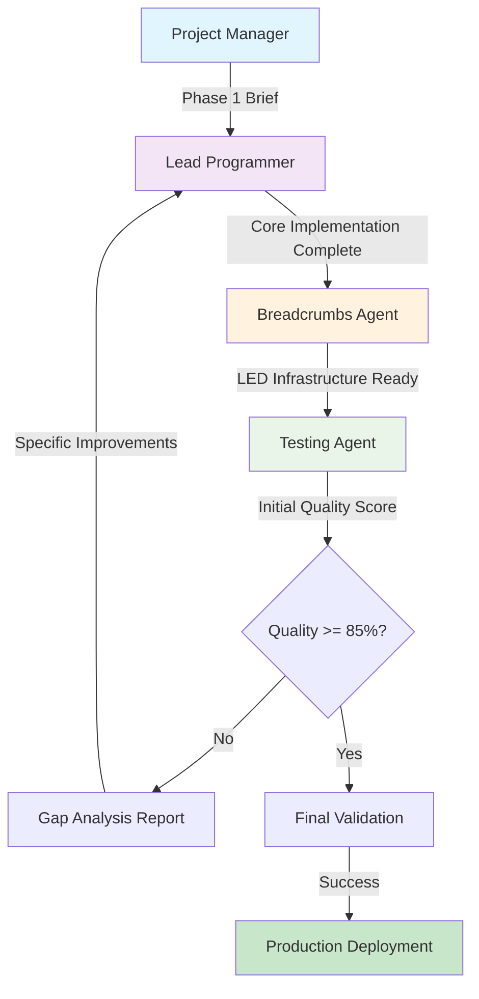

# Document Processing Implementation Workflow
**Project**: VoiceCoach Document Analysis Upgrade  
**Created**: August 23, 2025  
**Owner**: Project Manager  

## 🎯 PROJECT OVERVIEW

**Goal**: Replace fake regex document analysis with real Claude AI analysis integrated with Ollama semantic enhancement.

**Success Criteria**: 
- ✅ Real Claude analysis replacing fake regex patterns
- ✅ Semantic chunking for Ollama processing  
- ✅ Integration with KnowledgeBaseManager.tsx
- ✅ Quality score >= 85% vs browser benchmark
- ✅ Production-ready error handling and debugging

---

## 📋 IMPLEMENTATION PHASES

### 🔧 Phase 1: CORE IMPLEMENTATION (Lead Programmer)
**Duration**: 2-3 days  
**Agent**: Lead Programmer  
**Priority**: CRITICAL

#### **Tasks**:
1. **Remove Fake Analysis Code**
   - Delete `performUniversalDocumentAnalysis` fake regex implementation
   - Remove hard-coded Chris Voss patterns and responses
   - Clean up any mock data or simulated processing

2. **Implement Real Claude Analysis**
   - Create `performRealClaudeAnalysis` function
   - Integrate with existing Claude API infrastructure
   - Implement proper error handling and retry logic
   - Add timeout management and fallback mechanisms

3. **Semantic Chunking System**  
   - Design optimal chunk size for Ollama processing (aim for 2-4KB chunks)
   - Implement overlapping chunks to preserve context
   - Create chunk metadata tracking (position, relationships, importance)
   - Add chunk quality validation before processing

4. **KnowledgeBaseManager Integration**
   - Ensure analysis results properly integrate with existing component
   - Maintain existing UI/UX patterns while upgrading backend
   - Preserve user workflow and interaction patterns
   - Test with actual document uploads

#### **Deliverables**:
- ✅ Functional `performRealClaudeAnalysis` implementation
- ✅ Semantic chunking system with metadata
- ✅ KnowledgeBaseManager.tsx integration complete
- ✅ Error handling and fallback mechanisms
- ✅ Initial testing with sample documents

#### **Debug Prep Requirements (MANDATORY)**:
- Every state change must have trace ID
- All async operations must use error breadcrumbs
- Include debug.documentAnalysis() console commands
- Add breadcrumbs for user actions and API calls
- Implement trace size limits (<50KB per analysis)

---

### 🔍 Phase 2: LED DEBUGGING INFRASTRUCTURE (Breadcrumbs Agent)
**Duration**: 1-2 days  
**Agent**: Enhanced Breadcrumbs Agent  
**Depends On**: Phase 1 Core Implementation

#### **LED Ranges**:
- **LEDs 460-465**: Quality comparison tracking
- **LEDs 470-479**: Claude analysis pipeline monitoring  
- **LEDs 480-489**: Ollama enhancement tracking
- **LEDs 490-499**: Integration and error handling

#### **Tasks**:
1. **Quality Comparison LEDs (460-465)**
   ```javascript
   trail.light(460, { comparison_started: true, document_id, benchmark_type });
   trail.light(461, { browser_quality_score, analysis_time_ms });
   trail.light(462, { voicecoach_quality_score, processing_time_ms });
   trail.light(463, { quality_delta, meets_threshold: score >= 85 });
   trail.light(464, { gaps_identified: gap_list, priority_fixes });
   trail.light(465, { comparison_complete: true, overall_result });
   ```

2. **Claude Analysis Pipeline LEDs (470-479)**
   ```javascript
   trail.light(470, { claude_analysis_start: true, chunk_count, total_size });
   trail.light(471, { chunk_processing: chunk_id, chunk_size, position });
   trail.light(472, { claude_response_received: true, response_size, processing_time });
   trail.light(473, { analysis_parsing: parsed_sections, key_insights_count });
   trail.light(474, { error_encountered: error_type, retry_attempt, fallback_used });
   trail.light(475, { analysis_complete: true, total_insights, processing_summary });
   ```

3. **Ollama Enhancement LEDs (480-489)**  
   ```javascript
   trail.light(480, { ollama_enhancement_start: true, semantic_chunks });
   trail.light(481, { chunk_semantic_analysis: chunk_id, keywords_extracted, concepts });
   trail.light(482, { relationship_mapping: connections_found, context_bridges });
   trail.light(483, { enhancement_complete: enhanced_insights, added_context });
   ```

4. **Debug Console Commands**
   ```javascript
   // Add to window global commands
   debug.documentAnalysis = () => trail.recent(460, 489);
   debug.analysisQuality = () => trail.lights([460, 461, 462, 463]);
   debug.claudePipeline = () => trail.lights([470, 471, 472, 473, 474, 475]);
   debug.ollamaEnhancement = () => trail.lights([480, 481, 482, 483]);
   ```

#### **Deliverables**:
- ✅ Complete LED infrastructure for document processing
- ✅ Debug console commands for analysis monitoring
- ✅ Error detection and alerting through LEDs
- ✅ Performance tracking and bottleneck identification

---

### ✅ Phase 3: INITIAL VALIDATION (Testing Agent)
**Duration**: 1-2 days  
**Agent**: Claude Tester Agent  
**Depends On**: Phase 1 + Phase 2

#### **Tasks**:
1. **Baseline Document Testing**
   - Process test document (Chris Voss content)
   - Run identical analysis in browser for benchmark comparison
   - Document processing time, accuracy, and insight quality
   - Generate detailed comparison report

2. **Quality Scoring System**
   - Develop rubric for analysis quality (completeness, accuracy, actionability)
   - Compare VoiceCoach analysis vs browser analysis side-by-side
   - Calculate quality percentage score
   - Identify specific gaps and improvement areas

3. **Gap Analysis Report**  
   - Document areas where VoiceCoach analysis falls short
   - Prioritize gaps by impact and difficulty to fix
   - Create specific improvement recommendations for Lead Programmer
   - Set testing benchmarks for iterative improvement

4. **Performance Validation**
   - Monitor LED breadcrumbs during testing
   - Verify debug console commands work correctly
   - Test error handling and fallback mechanisms
   - Document any crashes, timeouts, or unexpected behaviors

#### **Quality Gates**:
- ✅ Functionality Test: Document processing completes without errors
- ✅ Quality Baseline: Initial quality score established and documented
- ✅ Debug Infrastructure: All LED tracking and console commands functional
- ✅ Gap Report: Specific improvement areas identified with priorities

#### **Deliverables**:
- ✅ Comprehensive test results report
- ✅ Quality scoring methodology and initial score
- ✅ Prioritized gap analysis with specific recommendations  
- ✅ Performance benchmarks and LED breadcrumb validation

---

### 🔄 Phase 4: ITERATIVE IMPROVEMENT LOOP
**Duration**: 3-4 days (variable based on quality target)  
**Agents**: Testing Agent → Lead Programmer → Breadcrumbs Agent (cycle)  

#### **Loop Process**:
```
START ITERATION:
1. Testing Agent: Run quality comparison test
2. IF quality_score < 85%:
   a. Testing Agent: Generate specific gap report  
   b. Lead Programmer: Implement gap fixes
   c. Breadcrumbs Agent: Add debugging for new features
   d. REPEAT from step 1
3. ELSE:
   EXIT LOOP → SUCCESS (proceed to Phase 5)
```

#### **Expected Iterations**:
- **Iteration 1**: Address major functional gaps (likely 60-70% quality)
- **Iteration 2**: Fix analysis depth and accuracy issues (likely 75-80% quality)
- **Iteration 3**: Polish edge cases and error handling (target 85%+ quality)
- **Iteration 4+**: Fine-tuning until 85% threshold achieved

#### **Quality Improvement Areas** (typical sequence):
1. **Analysis Completeness**: Ensure all document sections processed
2. **Insight Quality**: Improve depth and actionability of extracted insights
3. **Context Preservation**: Better semantic chunking and relationship mapping
4. **Error Handling**: Robust fallbacks and user experience during failures
5. **Performance Optimization**: Reduce processing time while maintaining quality

#### **Success Criteria for Exit**:
- ✅ Quality score >= 85% vs browser benchmark
- ✅ Processing time within acceptable limits (<2 minutes for typical documents)
- ✅ Error rate <5% with graceful fallback handling
- ✅ LED debugging shows healthy processing patterns
- ✅ No critical bugs or user-blocking issues

---

### 🎯 Phase 5: FINAL VALIDATION & DEPLOYMENT
**Duration**: 1 day  
**Agent**: Project Manager + Testing Agent  
**Depends On**: Successful Phase 4 completion

#### **Tasks**:
1. **Regression Testing**
   - Re-test all documents from Phase 3 to ensure quality maintained
   - Verify no performance degradation during improvement iterations
   - Confirm debug infrastructure still functional
   - Test error scenarios and fallback mechanisms

2. **User Acceptance Testing**
   - Process variety of document types beyond Chris Voss content
   - Test with different document sizes and formats
   - Verify UI/UX integration works seamlessly
   - Document any user-facing improvements or changes

3. **Production Deployment**
   - Final code review and cleanup
   - Remove any debug console logs meant for development only
   - Update documentation and user guides
   - Deploy to production environment

4. **Success Validation**
   - Confirm document processing works in production
   - Monitor LED breadcrumbs for any production-specific issues
   - Verify quality standards maintained in production environment
   - Document deployment success and final metrics

#### **Final Deliverables**:
- ✅ Production-ready document analysis system
- ✅ Quality score >= 85% maintained across document types
- ✅ Complete LED debugging infrastructure
- ✅ Updated documentation and user guides
- ✅ Deployment success report

---

## 🤝 AGENT COORDINATION FLOW



## 📊 COMMUNICATION PROTOCOL

### **Agent Handoff Requirements**:

#### **Lead Programmer → Breadcrumbs Agent**:
- ✅ Functional analysis implementation confirmed
- ✅ Error handling and edge cases documented  
- ✅ Integration points with KnowledgeBaseManager identified
- ✅ API endpoints and data flows mapped

#### **Breadcrumbs Agent → Testing Agent**:
- ✅ LED infrastructure operational (460-489 range)
- ✅ Debug console commands functional
- ✅ Error tracking and performance monitoring active
- ✅ Breadcrumb trail validation completed

#### **Testing Agent → Lead Programmer** (iteration loop):
- ✅ Specific gap analysis with examples
- ✅ Quality score breakdown by category
- ✅ Priority ranking of improvements needed
- ✅ Performance benchmarks and targets

#### **Testing Agent → Project Manager** (completion):
- ✅ Final quality score >= 85% achieved
- ✅ Regression testing passed
- ✅ Production readiness confirmed
- ✅ Deployment recommendation with metrics

### **Escalation Protocol**:
- **Quality Plateau**: If 3+ iterations don't improve quality → Project Manager review
- **Technical Blocker**: If implementation impossible → Architecture review needed
- **Timeline Concern**: If >7 days total → Scope or approach adjustment required

---

## ⏰ TIMELINE & MILESTONES

| Phase | Duration | Milestone | Dependencies |
|-------|----------|-----------|-------------|
| **Phase 1** | Day 1-3 | Core Implementation Complete | None |
| **Phase 2** | Day 2-4 | LED Debugging Ready | Phase 1 |
| **Phase 3** | Day 3-5 | Initial Validation Done | Phase 1 + 2 |
| **Phase 4** | Day 4-8 | Quality Target Achieved | Phase 3 |
| **Phase 5** | Day 8-9 | Production Deployment | Phase 4 |

**Total Estimated Duration**: 8-9 days  
**Critical Path**: Phase 1 → Phase 4 iterations → Phase 5

### **Daily Standups**:
- **Day 1-3**: Lead Programmer progress on core implementation
- **Day 4-6**: Testing results and iterative improvement planning
- **Day 7-8**: Final validation and deployment preparation
- **Day 9**: Production deployment and success confirmation

---

## 🚨 RISK MANAGEMENT

### **High-Risk Areas**:

#### **Claude API Integration Complexity**:
- **Risk**: Real Claude analysis more complex than anticipated
- **Mitigation**: Start with simple implementation, iterate to add sophistication
- **Fallback**: Maintain fake analysis as backup during development

#### **Quality Target Achievement**:
- **Risk**: 85% quality threshold proves difficult to reach
- **Mitigation**: Break down quality into specific, measurable components
- **Fallback**: Adjust target based on user value vs implementation cost

#### **Ollama Integration Issues**:
- **Risk**: Semantic enhancement doesn't integrate smoothly
- **Mitigation**: Implement Ollama as optional enhancement, not required
- **Fallback**: Ship Claude-only analysis if Ollama causes delays

#### **Performance Concerns**:
- **Risk**: Real analysis too slow for good user experience
- **Mitigation**: Implement streaming responses and progress indicators
- **Fallback**: Async processing with email notifications for large documents

### **Mitigation Strategies**:
1. **Parallel Development**: Begin LED infrastructure while core implementation progresses
2. **Incremental Testing**: Test each component individually before full integration
3. **User Feedback Loop**: Involve user in quality assessment during development
4. **Rollback Plan**: Maintain ability to revert to previous system if needed

---

## 📈 SUCCESS METRICS

### **Technical Metrics**:
- ✅ Quality Score: >= 85% vs browser benchmark
- ✅ Processing Time: <2 minutes for typical documents
- ✅ Error Rate: <5% with graceful fallbacks
- ✅ LED Coverage: Complete debugging coverage of analysis pipeline
- ✅ Integration Success: Seamless KnowledgeBaseManager.tsx operation

### **User Experience Metrics**:
- ✅ Functionality: Document processing works end-to-end
- ✅ Reliability: Consistent results across document types
- ✅ Debug Visibility: Clear error tracking and resolution
- ✅ Performance: Acceptable wait times with progress feedback

### **Development Quality Metrics**:
- ✅ Code Quality: Production-ready implementation with proper error handling
- ✅ Documentation: Complete LED breadcrumb mapping and debug commands
- ✅ Testing Coverage: Comprehensive validation across scenarios
- ✅ Deployment Success: Production rollout without issues

---

## 🎯 POST-IMPLEMENTATION REVIEW

### **Learning Capture** (to be completed):
- **What Worked Well**: Document successful patterns for future projects
- **Challenges Overcome**: Record solutions to significant obstacles  
- **Quality Achievement Method**: Document how 85% threshold was reached
- **Performance Optimizations**: Record effective speed improvements
- **User Feedback Integration**: How user needs shaped final implementation

### **Knowledge Transfer**:
- **Update Success Patterns**: Add proven approaches to CLAUDE-SUCCESS-PATTERNS.md
- **Document LED Patterns**: Add breadcrumb patterns to debugging guides
- **Architecture Documentation**: Update system diagrams and integration guides
- **Troubleshooting Guide**: Create guide for future document processing issues

---

**Generated with Claude Code**  
**Co-authored-by: Claude Project Manager**